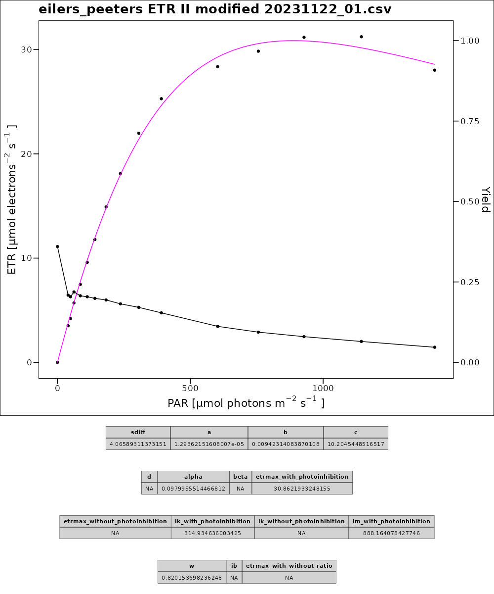
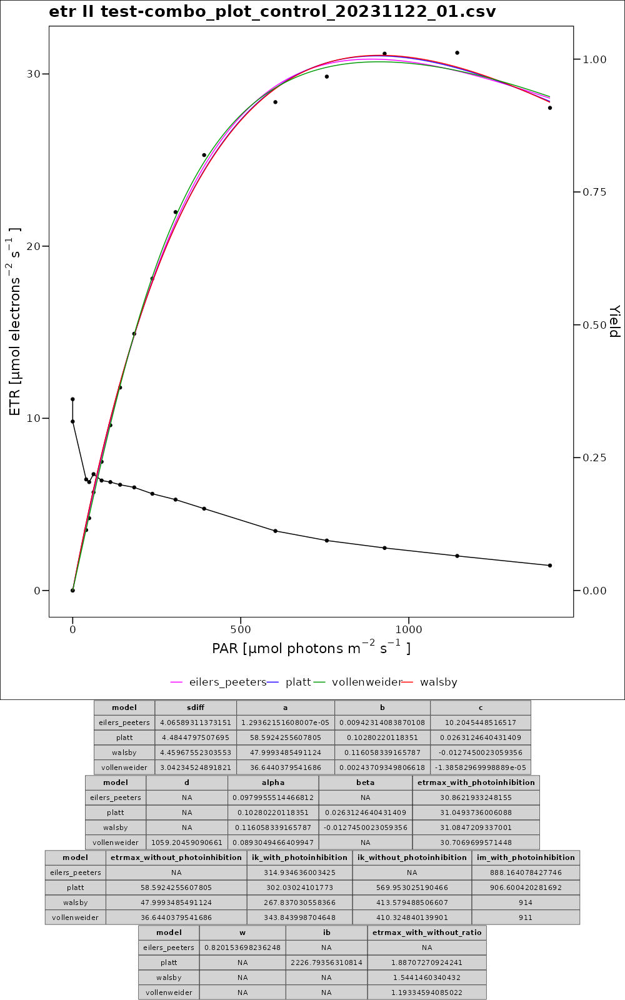

# library 'pam'

## Introduction

The library ‘pam’ was developed to process PAM raw data (chlorophyll fluorometry to analyze photosystem II and dual wavelength absorbance spectrometry to analyze photosystem I), for example from the DUAL PAM of the manufacturer WALZ.
Four different models are provided for the regression of the light curve (Vollenweider (1965), Platt (1980), Eilers and Peeters (1988) and Walsby (1997)).
To select the most suitable model for the respective data set, the models can be compared with each other. To avoid confusion in the naming of the variables and calculated factors such as $$ETR_{max}$$, it is possible to output both with publication-compliant naming and with homogenised naming.
Generated control plots make it possible to check each individual regression fit and calculated data.

## Install

### GitHub

```
install.packages("remotes")
remotes::install_github("Phi-S/pam", subdir = "src")
```

## Examples

Examples of usage can be found in the `examples` directory.

## Functions

### read_dual_pam_data()

#### Description

This function reads the original CSV file as created by the DualPAM software, processes it by calculating $$ETR$$ values, and returns a cleaned dataset.
Functionality with raw data from other PAM devices cannot be guaranteed.
Individual customisation may be necessary when reading data.

#### Parameters

- **csv_path**: A string representing the file path to the CSV file.
- **remove_recovery**: Automatic removal of recovery measurements after the actual Pi curve for an accurate regression. Default is `TRUE`.
- **etr_factor**: A numeric value used as a factor for calculating ETR. Default is `0.84`.
- **p_ratio**: A numeric value representing the ratio of PS II / PSI used in the ETR calculation formula. Default is `0.5`. Calculated as:

$$\textit{P–Ratio} = \frac{PPS2}{PPS1+2}$$

#### Details

ETR values are calculated using the following formula:

$$ ETR = PAR \cdot \textit{ETR–Factor} \cdot P–Ratio \cdot Yield $$

The function processes the provided CSV file by:

- Reading the CSV data using `read.csv()`.
- Filtering rows where the column `ID` equals `SP`.
- Combining the `Date` and `Time` columns to create a new `DateTime` column.
- Calculating the ETR values for both `Y.I.` and `Y.II.` using the function `calc_etr()`.
- Removing rows from the recovery period if `remove_recovery = TRUE`.

#### Return

A `data.table` containing the processed data with additional columns for recalculated ETR values.

#### Example

```r
data <- read_dual_pam_data("path/to/data.csv",
remove_recovery = TRUE,
etr_factor = 0.84,
p_ratio = 0.5)
```

#### References

- Heinz Walz GmbH. (2024). *DUAL-PAM-100 DUAL-PAM/F MANUAL, 5th Edition, April 2024, Chapter 7 (pp. 162-172).* Heinz Walz GmbH, Effeltrich, Germany. Available at: [DUAL-PAM-100 Manual](https://www.walz.com/files/downloads/manuals/dual-pam-100/DualPamEd05.pdf)

### vollenweider_generate_regression_ETR_I() and vollenweider_generate_regression_ETR_II()

This function generates a regression model based on Vollenweider (1965). Original naming conventions from the publication are used.

#### Parameters

- **data**: A `data.table` containing the input data from `read_dual_pam_data`.
- **etr_type**: A character string specifying the column name of the response variable (ETR I or ETR II) to be used in the model.
- **pmax_start_value_vollenweider**: Numeric. The starting value for the parameter $$p_{max}$$ in the model. Defaults to `pmax_start_values_vollenweider_default`.
- **a_start_value_vollenweider**: Numeric. The starting value for the parameter $$a$$ in the model. Defaults to `a_start_values_vollenweider_default`.
- **alpha_start_value**: Numeric. The starting value for the parameter $$\alpha$$ in the model. Defaults to `alpha_start_values_vollenweider_default`.
- **n_start_value**: Numeric. The starting value for the parameter $$n$$ in the model. Defaults to `n_start_values_vollenweider_default`.

#### Return

A list containing the following elements:

- **etr_regression_data**: A `data.table` with the predicted values of ETR I or ETR II to each PAR based on the fitted model.
- **sdiff**: The deviation between the actual and predicted ETR values.
- **pmax**: The maximum electron transport rate without photoinhibition ($$p_{max}$$).
- **a**: The obtained parameter $$a$$.
- **alpha**: The obtained parameter $$\alpha$$.
- **n**: The obtained parameter $$n$$.
- **popt**: The maximum electron transport rate with photoinhibition ($$p_{opt}$$). A function computes predicted photosynthetic rates for each PAR value and tracks the maximum rate observed:

```r
  popt <- 0
      pars <- c()
      predictions <- c()
      for (p in min(data$PAR):max(data$PAR)) {
        pars <- c(pars, p)
        prediction <- pmax * (((a * p) / (sqrt(1 + (a * p)^2))) * (1 / (sqrt(1 + (alpha * p)^2)^n)))
        predictions <- c(
          predictions,
          prediction
        )

        if (prediction > popt) {
          popt <- prediction
        }
      }
```

- **ik**: PAR where the transition point from light limitation to light saturation is achieved without photoinhibition ($$I_k$$). Calculated as:

$$I_k = \\frac{1}{a}$$

- **iik**: PAR where the transition point from light limitation to light saturation is achieved with photoinhibition ($$I_k^\prime$$). Calculated as:

$$I_k^\prime = \frac{I_k \cdot p_{opt}}{p_{max}}$$

- **pmax_popt_and_ik_iik_ratio**: Ratio of $$p_{max}$$ to $$p_{opt}$$ and $$I_k$$ to $$I_k^\prime$$ ($$p_{max} / p_{opt}$$). Calculated as:

$$\\p_max\\_popt\\_and\\_ik\\_iik\\_ratio = \frac{I_k}{I_k^\prime}$$

#### Details

This function uses non-linear least squares fitting to estimate the parameters for the Vollenweider model, which describes the relationship between PAR and ETR. The model used is:

$$p = p_{max} \cdot \frac{a \cdot i}{\sqrt{1 + (a \cdot i)^2}} \cdot \frac{1}{\left(\sqrt{1 + (\alpha \cdot i)^2}\right)^n}$$

It is valid: $$i = PAR; p = ETR$$

#### Example

```r
result_vollenweider_ETR_II <- vollenweider_generate_regression_ETR_II(data, 
    pmax_start_value_vollenweider = 40, 
    a_start_value_vollenweider = 0.1, 
    alpha_start_value = -0.0001, 
    n_start_value = 350)
```

#### References

Vollenweider, R. A. (1965). *Calculation models of photosynthesis-depth curves and some implications regarding day rate estimates in primary production measurements*, p. 427-457. In C. R. Goldman [ed.], *Primary Productivity in Aquatic Environments*. Mem. Ist. Ital. Idrobiol., 18 Suppl., University of California Press, Berkeley.

### platt_generate_regression_ETR_I() and platt_generate_regression_ETR_II()

This function generates a regression model based on  Platt (1980). Original naming conventions from the publication are used.

#### Parameters

- **data**: A `data.table` containing the input data from `read_dual_pam_data`.
- **alpha_start_value_platt**: Numeric. The starting value for the parameter $$\alpha$$ in the model. Defaults to `alpha_start_value_platt_default`.
- **beta_start_value_platt**: Numeric. The starting value for the parameter $$\beta$$ in the model. Defaults to `beta_start_value_platt_default`.
- **ps_start_value_platt**: Numeric. The starting value for the parameter $$p_s$$ in the model. Defaults to `ps_start_value_platt_default`.

#### Return

A list containing the following elements:

- **etr_regression_data**: A `data.table` with the predicted values of ETR I or ETR II to each PAR based on the fitted model.
- **sdiff**: The deviation between the actual and predicted ETR values.
- **ps**: The maximum electron transport rate without photoinhibition ($$P_s$$).
- **alpha**: The initial slope of the light curve ($$\alpha$$).
- **beta**: The photoinhibition of the light curve ($$\beta$$).
- **pm**: The maximum electron transport rate with photoinhibition ($$P_m$$). Calculated as:

$$P_m = P_s \cdot \left(\frac{\alpha}{\alpha + \beta}\right) \cdot \left(\left(\frac{\beta}{\alpha + \beta}\right)^{\frac{\beta}{\alpha}}\right)$$

- **ik**: PAR where the transition point from light limitation to light saturation is achieved with photoinhibition ($$I_k$$). Calculated as:

$$I_k = \frac{P_m}{\alpha}$$

- **is**: PAR where the transition point from light limitation to light saturation is achieved without photoinhibition ($$I_s$$). Calculated as:

$$I_s = \frac{P_s}{\alpha}$$

- **im**: The PAR at which the maximum electron transport rate is achieved with photoinhibition ($$I_m$$). Calculated as:

$$I_m = \left(\frac{P_s}{\alpha}\right) \cdot \log\left(\frac{\alpha + \beta}{\beta}\right)$$

- **ib**: ($$I_b$$) Calculated as:

$$I_b = \frac{P_s}{\beta}$$

#### Details

This function uses non-linear least squares fitting to estimate the parameters for the Platt model, which describes the relationship between PAR and ETR. The model used is:

$$P = P_s \cdot \left(1 - e^\frac{{-\alpha \cdot I}}{P_s}\right) \cdot e^\left(\frac{{-\beta \cdot I}}{P_s}\right)$$

It is valid: $$I = PAR; p = ETR$$

#### Example

```r
result_platt_ETR_II <- platt_generate_regression_ETR_II(data, 
    alpha_start_value_platt = 0.3, 
    beta_start_value_platt = 0.01, 
    ps_start_value_platt = 30)
```

#### References

Platt, T., Gallegos, C. L., & Harrison, W. G. (1980). *Photoinhibition of photosynthesis in natural assemblages of marine phytoplankton*. Journal of Marine Research, 38(4). Retrieved from <https://elischolar.library.yale.edu/journal_of_marine_research/1525>.

### eilers_peeters_generate_regression_ETR_I() and eilers_peeters_generate_regression_ETR_II()

This function generates a regression model based on  Eilers-Peeters (1988). Original naming conventions from the publication are used. All parameters are calculated taking photoinhibition into account.

#### Parameters

- **data**: A `data.table` containing the input data from `read_dual_pam_data`.
- **a_start_value**: Numeric. The starting value for the parameter $$a$$ in the model. Defaults to `a_start_values_eilers_peeters_default`.
- **b_start_value**: Numeric. The starting value for the parameter $$b$$ in the model. Defaults to `b_start_values_eilers_peeters_default`.
- **c_start_value**: Numeric. The starting value for the parameter $$c$$ in the model. Defaults to `c_start_values_eilers_peeters_default`.

#### Return

A list containing the following elements:

- **etr_regression_data**: A `data.table` with the predicted values of ETR I or ETR II to each PAR based on the fitted model.
- **sdiff**: The deviation between the actual and predicted ETR values.
- **a**: The obtained parameter $$a$$.
- **b**: The obtained parameter $$b$$.
- **c**: The obtained parameter $$c$$.
- **pm**: The maximum electron transport rate ($$p_m$$). Calculated as:

$$p_m = \frac{1}{b + 2 \sqrt{a \cdot c}}$$

- **s**: The initial slope of the light curve ($$s$$). Calculated as:

$$s = \frac{1}{c}$$

- **ik**: PAR where the transition point from light limitation to light saturation is achieved ($$I_k$$). Calculated as:

$$I_k = \frac{c}{b + 2 \sqrt{a \cdot c}}$$

- **im**: The PAR at which the maximum electron transport rate is achieved ($$I_m$$). Calculated as:

$$I_m = \sqrt{\frac{c}{a}}$$

- **w**: The sharpness of the peak ($$w$$). Calculated as:

$$w = \frac{b}{\sqrt{a \cdot c}}$$

#### Details

This function uses non-linear least squares fitting to estimate the parameters for the Eilers-Peeters model, which describes the relationship between PAR and ETR. The model used is:

$$ p = \frac{I}{a \cdot I^2 + b \cdot I + c} $$

It is valid: $$I = PAR$$; $$p = ETR$$

#### Example

```r
result_eilers_peeters_ETR_II <- eilers_peeters_generate_regression_ETR_II(data,
a_start_value = 0.00004,
b_start_value =  0.004,
c_start_value = 5)
```

#### References

Eilers, P. H. C., & Peeters, J. C. H. (1988). *A model for the relationship between light intensity and the rate of photosynthesis in phytoplankton.* Ecological Modelling, 42(3-4), 199-215. [doi:10.1016/0304-3800(88)90057-9](https://doi.org/10.1016/0304-3800(88)90057-9).

### walsby_generate_regression_ETR_I() and walsby_generate_regression_ETR_II()

This function generates a regression model based on  Walsby (1997) in a modified version without the respiration term. Naming conventions from Romoth (2019) are used. ETRmax is calculated without taking photoinhibition into account.

#### Parameters

- **data**: A `data.table` containing the input data from `read_dual_pam_data`.
- **etr_max_start_value_walsby**: Numeric. The starting value for the parameter $$ETR_{max}$$ in the model. Defaults to `etr_max_start_value_walsby_default`.
- **alpha_start_value_walsby**: Numeric. The starting value for the parameter $$\alpha$$ in the model. Defaults to `alpha_start_value_walsby_default`.
- **beta_start_value_walsby**: Numeric. The starting value for the parameter $$\beta$$ in the model. Defaults to `beta_start_value_walsby_default`.

#### Return

A list containing the following elements:

- **etr_regression_data**: A `data.table` with the predicted values of ETR I or ETR II to each PAR based on the fitted model.
- **sdiff**: The deviation between the actual and predicted ETR values.
- **etr_max**: The maximum electron transport rate without photoinhibition ($$ETR_{max}$$).
- **alpha**: The initial slope of the light curve ($$\alpha$$).
- **beta**: The photoinhibition of the light curve ($$\beta$$).

#### Details

This function uses non-linear least squares fitting to estimate the parameters for the Walsby model, which describes the relationship between PAR and ETR I. The model used is:

$$ETR = ETR_{max} \cdot \left(1 - e^{\left(-\frac{\alpha \cdot I}{ETR_{max}}\right)}\right) + \beta \cdot I$$

It is valid: $$I = PAR$$

#### References

Walsby, A. E. (1997). Numerical integration of phytoplankton photosynthesis through time and depth in a water column. *New Phytologist*, 136(2), 189-209. <https://doi.org/10.1046/j.1469-8137.1997.00736.x>

Romoth, K., Nowak, P., Kempke, D., Dietrich, A., Porsche, C., & Schubert, H. (2019). Acclimation limits of *Fucus evanescens* along the salinity gradient of the southwestern Baltic Sea. *Botanica Marina*, 62(1), 1-12. <https://doi.org/10.1515/bot-2018-0098>

### vollenweider_modified()

This function adds parameters that were not originally included in the Vollenweider (1965) model, but were introduced by other models and renames the parameters to a standardised one for all models. See the table below.

#### Parameters

- **model_result**: A list containing the results of the model, including parameters such as `pmax`, `alpha`, and `ik`.

#### Return

Returns a modified model result as a list with the following elements:

- **etr_type**: ETR Type based on the model result.
- **etr_regression_data**: Regression data with ETR predictions based on the fitted model.
- **sdiff**: The difference between observed and predicted ETR values.
- **a**: obtained paramter `a`, here equal to `etrmax_without_photoinhibition`
- **b**: obtained paramter `b`, transfered as `a`
- **c**: obtained paramter `c`, here transfered as `alpha`
- **d**: obtained paramter `c`, here transfered as `n`
- **alpha**: The initial slope of the light curve, calculated as:

$${alpha} = \frac{{etrmax\\_with\\_photoinhibition}}{{ik\\_without\\_photoinhibition}}$$

- **beta**: Not available, here set to `NA_real_`
- **etrmax_with_photoinhibition**: The maximum electron transport rate with photoinhibition, transfered as `popt`
- **etrmax_without_photoinhibition**: The maximum electron transport rate without photoinhibition, transfered as: `pmax`
- **ik_with_photoinhibition**: PAR where the transition point from light limitation to light saturation is achieved taking photoinhibition into account, transfered as: `iik`
- **ik_without_photoinhibition**: PAR where the transition point from light limitation to light saturation is achieved not taking photoinhibition into account, transfered as: `ik`
- **im_with_photoinhibition**: The PAR at which the maximum electron transport rate is achieved by taking photoinhibition into account, determined as:

```r
 etr_regression_data <- get_etr_regression_data_from_model_result(model_result)
  im_with_photoinhibition <- etr_regression_data[etr_regression_data[[prediction_name]] == max(etr_regression_data[[prediction_name]]), ][[PAR_name]]
```

- **w**: Not available, here set to `NA_real_`
- **ib**: Not available, here set to `NA_real_`
- **etrmax_with_without_ratio**: Ratio of `etrmax_with_photoinhibition` to `etrmax_without_photoinhibition` and `ik_with_photoinhibition` to `ik_without_photoinhibition`,  transfered as: `pmax_popt_and_ik_iik_ratio`

#### Details

This function validates the `model_result` input and processes relevant parameters for the Vollenweider model, creating a structured list using `create_modified_model_result`. This standardized output allows for consistent analysis and comparison across different models.

#### Examples

```r
modified_result_vollenweider <- vollenweider_modified(model_result_vollenweider)
```

### platt_modified()

This function adds parameters that were not originally included in the Platt (1980) model, but were introduced by other models and renames the parameters to a standardised one for all models. See the table below.

#### Parameters

- **model_result**: A list containing the results of the model, including parameters such as `etr_max`, `alpha`, and `beta`.

#### Return

Returns a modified model result as a list with the following elements:

- **etr_type**: ETR Type based on the model result.
- **etr_regression_data**: Regression data with ETR predictions based on the fitted model.
- **sdiff**: The difference between observed and predicted ETR values.
- **a**: obtained paramter `a`, here equal to `etrmax_without_photoinhibition`
- **b**: obtained paramter `b`, here equal to `alpha`
- **c**: obtained paramter `c`, here equal to `beta`
- **d**: not available, here set to `NA_real_`
- **alpha**: The initial slope of the light curve, transfered unchanged as `alpha`
- **beta**: The photoinhibition of the light curve, transfered unchanged as `beta`
- **etrmax_with_photoinhibition**: The maximum electron transport rate with photoinhibition, transfered as `pm`
- **etrmax_without_photoinhibition**: The maximum electron transport rate without photoinhibition, transfered as: `ps`
- **ik_with_photoinhibition**: PAR where the transition point from light limitation to light saturation is achieved taking photoinhibition into account, transfered as: `ik`
- **ik_without_photoinhibition**: PAR where the transition point from light limitation to light saturation is achieved not taking photoinhibition into account, transfered as: `is`
- **im_with_photoinhibition**: The PAR at which the maximum electron transport rate is achieved by taking photoinhibition into account, transfered as: `im`
- **w**: Not available, here set to `NA_real_`
- **ib**: Transfered unchange as: `ib`
- **etrmax_with_without_ratio**: Ratio of `etrmax_with_photoinhibition` to `etrmax_without_photoinhibition` and `ik_with_photoinhibition` to `ik_without_photoinhibition`. Calculated as:

$${{etrmax\\_with\\_without\\_ratio}} = \frac{{etrmax\\_with\\_photoinhibition}}{{etrmax\\_without\\_photoinhibition}}$$

#### Details

This function validates the `model_result` input and processes relevant parameters for the Platt model, creating a structured list using `create_modified_model_result`. This standardized output allows for consistent analysis and comparison across different models.

#### Examples

```r
modified_result_platt <- platt_modified(model_result_platt)
```

### eilers_peeters_modified()

This function adds parameters that were not originally included in the Eilers and Peeters (1988) model, but were introduced by other models and renames the parameters to a standardised one for all models. See the table below.

#### Parameters

- **model_result**: A list containing the results of the model, including parameters such as `a`, `b`, `c`, `s`, `pm`, `ik`, `im`, and `w`.

#### Return

Returns a modified model result as a list with the following elements:

- **etr_type**: ETR Type based on the model result.
- **etr_regression_data**: Regression data with ETR predictions based on the fitted model.
- **sdiff**: The difference between observed and predicted ETR values.
- **a**: The obtained parameter $$a$$
- **b**: The obtained parameter $$b$$
- **c**: The obtained parameter $$c$$
- **d**: Not available, here set to `NA_real_`
- **alpha**: The initial slope of the light curve, transfered unchanged as `s`
- **beta**: Not available, here set to `NA_real_`
- **etrmax_with_photoinhibition**: The maximum electron transport rate with photoinhibition, transfered as `pm`
- **etrmax_without_photoinhibition**: Not available, here set to `NA_real_`
- **ik_with_photoinhibition**: PAR where the transition point from light limitation to light saturation is achieved taking photoinhibition into account, transfered as `ik`
- **ik_without_photoinhibition**: Not available, here set to `NA_real_`
- **im_with_photoinhibition**: The PAR at which the maximum electron transport rate is achieved by taking photoinhibition into account, transfered as`im`
- **w**: The sharpness of the peak, transfered as `w`
- **ib**: Not available, here set to `NA_real_`
- **etrmax_with_without_ratio**: Not available, here set to `NA_real_`

#### Details

This function validates the `model_result` input, extracts relevant parameters for the modified Eilers-Peeters model, and creates a structured list using `create_modified_model_result`. The list serves as a standardized output format for further analysis.

#### Examples

```r
# Example usage for eilers_peeters_modified
modified_result <- eilers_peeters_modified(model_result_eilers_peeters)
```

### walsby_modified()

This function adds parameters that were not originally included in the Walsby (1997) model, but were introduced by other models and renames the parameters to a standardised one for all models. See the table below.

#### Parameters

- **model_result**: A list containing the results of the model, including parameters such as `etr_max`, `alpha`, and `beta`.

#### Return

Returns a modified model result as a list with the following elements:

- **etr_type**: ETR Type based on the model result.
- **etr_regression_data**: Regression data with ETR predictions based on the fitted model.
- **sdiff**: The difference between observed and predicted ETR values.
- **a**: obtained paramter `a`, here equal to `etrmax_without_photoinhibition`
- **b**: obtained paramter `b`, here equal to `alpha`
- **c**: obtained paramter `c`, here equal to `beta`
- **d**: not available, here set to `NA_real_`
- **alpha**: The initial slope of the light curve, transfered unchanged as `alpha`
- **beta**: The photoinhibition of the light curve, transfered unchanged as `beta`
- **etrmax_with_photoinhibition**: The maximum electron transport rate with photoinhibition, determined as:

```r
  etr_regression_data <- get_etr_regression_data_from_model_result(model_result)
  etr_max_row <- etr_regression_data[etr_regression_data[[prediction_name]] == max(etr_regression_data[[prediction_name]]), ]
  etrmax_with_photoinhibition <- etr_max_row[[prediction_name]]
```

- **etrmax_without_photoinhibition**: The maximum electron transport rate without photoinhibition, transfered as: `etr_max`
- **ik_with_photoinhibition**: PAR where the transition point from light limitation to light saturation is achieved taking photoinhibition into account, calculated as:

$$ik\\_with\\_photoinhibition = \frac{etrmax\\_with\\_photoinhibition}{alpha}$$

- **ik_without_photoinhibition**: PAR where the transition point from light limitation to light saturation is achieved not taking photoinhibition into account, calculated as:

$$ik\\_without\\_photoinhibition = \frac{etrmax\\_without\\_photoinhibition}{alpha}$$

- **im_with_photoinhibition**: The PAR at which the maximum electron transport rate is achieved by taking photoinhibition into account, calculated as:

```r
  etr_regression_data <- get_etr_regression_data_from_model_result(model_result)
  etr_max_row <- etr_regression_data[etr_regression_data[[prediction_name]] == max(etr_regression_data[[prediction_name]]), ]
  im_with_photoinhibition <- etr_max_row[[PAR_name]]
```

- **w**: Not available, here set to `NA_real_`
- **ib**: Not available, here set to `NA_real_`
- **etrmax_with_without_ratio**: Ratio of `etrmax_with_photoinhibition` to `etrmax_without_photoinhibition` and `ik_with_photoinhibition` to `ik_without_photoinhibition`. Calculated as:

$${{etrmax\\_with\\_without\\_ratio}} = \frac{{etrmax\\_with\\_photoinhibition}}{{etrmax\\_without\\_photoinhibition}}$$

#### Details

This function validates the `model_result` input and processes relevant parameters for the Walsby model, creating a structured list using `create_modified_model_result`. This standardized output allows for consistent analysis and comparison across different photosynthesis models.

#### Examples

```r
modified_result <- walsby_modified(model_result_walsby)
```

### Naming overview

#### Publication-accurate naming and the respective modified naming

modified        |Eilers and Peeters |Platt    |Walsby          |Vollenweider    |
|-|-|-|-|-|
|a         |a     |ps     |etr_max         |pmax      |
|b         |b     |alpha    |alpha          |a       |
|c         |c     |beta    |beta          |alpha      |
|d         |NA     |NA     |NA           |n       |
|alpha        |s     |alpha    |alpha          |NA       |
|beta        |NA     |beta    |beta          |NA       |
|etrmax_with_photoinhibition  |pm     |pm     |NA           |popt      |
|etrmax_without_photoinhibition  |NA     |ps     |etr_max         |pmax      |
|ik_with_photoinhibition   |ik     |ik     |NA           |iik      |
|ik_without_photoinhibition   |NA     |is     |NA           |ik       |
|im_with_photoinhibition   |im     |im     |NA           |NA       |
|w         |w     |NA     |NA           |NA       |
|ib         |NA     |ib     |NA           |NA       |
|etrmax_with_without_ratio   |NA     |NA     |NA           |pmax_popt_and_ik_iik_ratio |
|sdiff        |sdiff    |sdiff    |sdiff          |sdiff      |

#### Publication-accurate naming and the respective modified naming with additional calculations not included in the original publication

|modified      |Eilers and Peeters |Platt    |Walsby          |Vollenweider    |
|-|-|-|-|-|
|sdiff        |sdiff    |sdiff    |sdiff          |sdiff      |
|a         |a     |ps     |etr_max         |pmax      |
|b         |b     |alpha    |alpha          |a       |
|c         |c     |beta    |beta          |alpha      |
|d         |NA     |NA     |NA           |n       |
|alpha        |s     |alpha    |alpha          |real_alpha     |
|beta        |NA     |beta    |beta          |NA       |
|etrmax_with_photoinhibition  |pm     |pm     |etrmax_with_photoinhibition    |popt      |
|etrmax_without_photoinhibition  |NA     |ps     |etr_max         |pmax      |
|ik_with_photoinhibition   |ik     |ik     |ik_with_photoinhibition     |iik      |
|ik_without_photoinhibition   |NA     |is     |ik_without_photoinhibition     |ik       |
|im_with_photoinhibition   |im     |im     |im_with_photoinhibition     |im_with_photoinhibition |
|w         |w     |NA     |NA           |NA       |
|ib         |NA     |ib     |NA           |NA       |
|etrmax_with_without_ratio   |NA     |etrmax_with_without_ratio  |etrmax_with_without_ratio |pmax_popt_and_ik_iik_ratio |

### compare_regression_models_ETR_I() and compare_regression_models_ETR_II()

This function compares different regression models.

#### Parameters

- **data_dir**: A character string specifying the directory where the input data files are located.

#### Return

A vector containing the total points assigned to each regression model based on their performance. Models are ranked based on the calculated deviation of the difference between observed and predicted values. Rating:

- 1st: 3 points
- 2nd: 2 points
- 3rd: 1 point
- 4th: 0 points

#### Details

This function allows a straightforward comparison of the models: Eilers-Peeters (1988), Platt (1980), Vollenweider (1965), and Walsby (1997). The results can guide users in selecting the most appropriate model for their data. If regression is not possible for a model, no points are awarded for the file for any of the models. Start values cannot be adjusted in this function.

#### Example

```r
#raw data file directory
data_dir_compare <- file.path(getwd(), "data")

#compare regression models
compare_regression_models_ETR_II <- compare_regression_models_ETR_II(data_dir_compare)
print(compare_regression_models_ETR_II)
```

#### References

Eilers, P. H. C., & Peeters, J. C. H. (1988). *A model for the relationship between light intensity and the rate of photosynthesis in phytoplankton.* Ecological Modelling, 42(3-4), 199-215. [doi:10.1016/0304-3800(88)90057-9](https://doi.org/10.1016/0304-3800(88)90057-9).

Platt, T., Gallegos, C. L., & Harrison, W. G. (1980). *Photoinhibition of photosynthesis in natural assemblages of marine phytoplankton*. Journal of Marine Research, 38(4). Retrieved from <https://elischolar.library.yale.edu/journal_of_marine_research/1525>.

Romoth, K., Nowak, P., Kempke, D., Dietrich, A., Porsche, C., & Schubert, H. (2019). Acclimation limits of *Fucus evanescens* along the salinity gradient of the southwestern Baltic Sea. *Botanica Marina*, 62(1), 1-12. <https://doi.org/10.1515/bot-2018-0098>

Vollenweider, R. A. (1965). *Calculation models of photosynthesis-depth curves and some implications regarding day rate estimates in primary production measurements*, p. 427-457. In C. R. Goldman [ed.], *Primary Productivity in Aquatic Environments*. Mem. Ist. Ital. Idrobiol., 18 Suppl., University of California Press, Berkeley.

Walsby, A. E. (1997). Numerical integration of phytoplankton photosynthesis through time and depth in a water column. *New Phytologist*, 136(2), 189-209. <https://doi.org/10.1046/j.1469-8137.1997.00736.x>

### plot_control()

This function creates a control plot for the used model based on the provided data and model results.

#### Parameters

- **data**: A `data.table` containing the original ETR and yield data for the plot.
- **model_result**: A list containing the fitting results of the used model and the calculated parameters (alpha, ik, etc.).
- **title**: A character string that specifies the title of the plot.
- **color**: A color specification for the regression line in the plot.

#### Return

A plot displaying the original ETR and Yield values and the regression data. A table below the plot shows the calculated data (alpha, ik, etc.).

#### Example

```r
plot_control_eilers_peeters_ETR_II <- plot_control(
  data = pam_data,
  model_result = modified_model_result_eilers_peeters_ETR_II,
  title = "eilers_peeters ETR II modified 20231122_01.csv",
  color = "purple"
)
print(plot_control_eilers_peeters_ETR_II)
```




### combo_control_plot()

The `combo_control_plot` function generates a combined plot of electron transport rate (ETR) data and regression model predictions, along with a customized table summarizing the parameters for each model.

#### Parameters

- **title**: A character string specifying the title for the plot.
- **data**: A data frame containing the raw input data for ETR and Photosynthetically Active Radiation (PAR).
- **model_results**: A list of model results, where each model result is a list containing regression data and parameters for ETR.
- **name_list**: A list of names corresponding to each model result. These names will be used in the legend and table.
- **color_list**: A list of color values for each model result. Colors are used to differentiate lines on the plot.

#### Return

A plot displaying the original ETR and Yield values and the regression data from different models. A table below the plot shows the calculated data (alpha, ik, etc.).

#### Examples

```r
test_data_file <- file.path(getwd(), "data", "20231122_01.csv")
    data <- read_dual_pam_data(test_data_file)

    eilers_peeters <- eilers_peeters_modified(eilers_peeters_generate_regression_ETR_II(data))
    platt <- platt_modified(platt_generate_regression_ETR_II(data))
    walsby <- walsby_modified(walsby_generate_regression_ETR_II(data))
    vollenweider <- vollenweider_modified(vollenweider_generate_regression_ETR_II(data))

    plot <- combo_control_plot(
      "etr II test-combo_plot_control_20231122_01.csv",
      data,
      list(eilers_peeters, platt, walsby, vollenweider),
      list("eilers_peeters", "platt", "walsby", "vollenweider"),
      list("purple", "blue", "green", "red")
    )
```



### write_model_result_csv()

This function exports the raw input data, regression data, and model parameters into separate CSV files for easy access and further analysis.

#### Parameters

- **dest_dir**: A character string specifying the directory where the CSV files will be saved.
- **name**: A character string specifying the base name for the output files.
- **data**: A data frame containing the raw input data used in the model.
- **model_result**: A list containing the model results, including parameter values and regression data.

#### Details

This function creates three CSV files:

1. **`name_raw_data.csv`**: Contains the original raw data used in the model.
2. **`name_regression_data.csv`**: Contains the regression data with predictions for electron transport rate (ETR).
3. **`name_model_result.csv`**: Contains the parameter values from the model results (excluding regression data), including parameters like `alpha`, `beta`, and `etr_max`.

Each file will be named using the `name` parameter as a prefix, followed by a specific suffix for clarity.

#### Examples

```r
write_model_result_csv(
  dest_dir = "output",
  name = "eilers_peeters_experiment_001",
  data = raw_data,
  model_result = model_result_eilers_peeters
)
```

### known issues

#### subscript out of bounds

```
Skipped file: 20231214_14_W6_T5_ML.csv because of error: Error in eilers_peeters[["sdiff"]]: subscript out of bounds
```

This could indicate that Pm lable in the Action column is at the wrong position in the csv raw data file. Error could be caused by WALZ-Software.

#### Removed rows in combo_plot_control

```
Warnings:
1: Removed 1 row containing missing values or values outside the scale range (`geom_point()`). 
2: Removed 1 row containing missing values or values outside the scale range (`geom_point()`). 
3: Removed 1 row containing missing values or values outside the scale range (`geom_line()`).
```
All points and lines present. Reason for warning messages unknown. Possibly a problem in the library ggplot2.

### test all

```
library(devtools);
devtools::test();
```

### test specific file

```
library(devtools);
devtools::load_all();
library(testthat);
test_file('$$path')"
```

## Linux dependencies for devtools

Ubuntu:
libxml2-dev
libssl-dev
libcurl4-openssl-dev
libfontconfig1-dev
libharfbuzz-dev
libfribidi-dev
libfreetype6-dev libpng-dev libtiff5-dev libjpeg-dev

Debian:
libxml2-dev libssl-dev libcurl4-openssl-dev libfontconfig1-dev libharfbuzz-dev libfribidi-dev libfreetype6-dev libpng-dev libjpeg-dev libfreetype6-dev libpng-dev libtiff5-dev libjpeg-dev

install.packages("data.table")
install.packages("dplyr")
install.packages("ggplot2")
install.packages("minpack.lm")
install.packages("SciViews")
install.packages("ggthemes")
install.packages("gridExtra")
