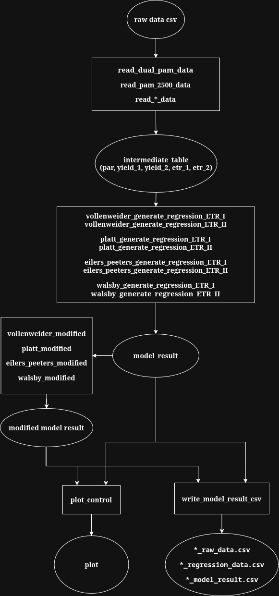

# library 'pam' <a href="https://www.researchgate.net/publication/404020183_pam_An_R_Package_for_Fast_and_Efficient_Processing_of_Pulse-Amplitude_Modulation_Data"></a>

[](https://cran.r-project.org/package=pam)
[](https://cran.r-project.org/web/checks/check_results_pam.html)
[](https://cran.r-project.org/package=pam)
[](https://cran.r-project.org/package=pam)


## Introduction

Rapid light curves recorded via the pulse‐amplitude modulation (PAM) technique are widely used to characterize photosynthesis, enabling the determination of key photosynthetic parameters. However, deriving these kinetic parameters from raw data requires fitting to regression models, a process traditionally involving laborious and error‐prone manual steps. Our R package pam streamlines this process by automating regression analysis, enabling fast and reproducible processing of large datasets. It provides the models of Vollenweider (1965), Platt et al. (1980), Eilers and Peeters (1988) and Walsby (1997).

- J. Böhm and P. Schrag, ‘pam: An R Package for Fast and Efficient Processing of Pulse‐Amplitude Modulation Data’, Ecology and Evolution, vol. 16, no. 4, p. e73400, Apr. 2026, doi: [10.1002/ece3.73400](https://www.researchgate.net/publication/404020183_pam_An_R_Package_for_Fast_and_Efficient_Processing_of_Pulse-Amplitude_Modulation_Data).

## Publications using this package

- J. Böhm, J. Trossen, I. Blindow, and H. Schubert, ‘Impact of temperature and light on the physiology and morphology of *Chara hispida* L. (Charophyceae)’, Aquatic Botany, vol. 206, p. 104022, Sep. 2026, doi: [10.1016/j.aquabot.2026.104022](https://www.researchgate.net/publication/402846331_Impact_of_temperature_and_light_on_the_physiology_and_morphology_of_Chara_hispida_L_Charophyceae).

- J. Böhm, I. Blindow, N. Gyllenstrand, W. Diewald, and H. Schubert, ‘*Sphaerochara canadensis* (Charophyceae): A circumpolar species with a high temperature optimum’, Journal of Phycology, vol. 61, no. 6, pp. 1863–1873, Dec. 2025, doi: [10.1111/jpy.70111](https://www.researchgate.net/publication/398295400_Sphaerochara_canadensis_Charophyceae_A_circumpolar_species_with_a_high_temperature_optimum).

- A continuously updated overview of studies using this package can be accessed via ResearchGate ([publication](https://www.researchgate.net/publication/404020183_pam_An_R_Package_for_Fast_and_Efficient_Processing_of_Pulse-Amplitude_Modulation_Data/citations), [package](https://www.researchgate.net/publication/395536281_pam_Fast_and_Efficient_Processing_of_PAM_Data/citations))

## Installation

```r
# The easiest way to install 'pam' is from CRAN:
install.packages("pam")

# Alternatively, you can install it from GitHub:
install.packages("remotes")
remotes::install_github("biotoolbox/pam", subdir = "src")

# To install the development version from GitHub:
install.packages("remotes")
remotes::install_github("biotoolbox/pam", subdir = "src", ref = "dev")
```

## Examples

Examples of usage can be found in the [examples](examples/) directory:

- [Single CSV](examples/example_single_data.R) → Reads a single CSV, generates regression data using Eilers and Peeters model, modifies the model result, generates control plot and exports the plot as jpg and the result as csv files.
- [Multiple CSV's](examples/example_multiple_data.R) → Reads multiple CSV files, generates regression data using Eilers and Peeters model, modifies the model result, generates control plot and exports the plots as pdf and the result as csv files.
- [Combo control plot](examples/example_combo_plot_control.R) → Generates one control plot containing all models from a single csv file and exports the plot as jpg.
- [Compare models](examples/example_compare_models.R) → Compares all models against each other based on one data set and prints the score.

## Functions

For detailed information about these functions, visit the respective documentation:

- [Read CSV Data](docs/functions/read_data.md) → Reads the raw data CSV files and returns the intermediate table.
- [Generate Regressions](docs/functions/generate_regressions.md) → Generates ETR regression data from the chosen model.
- [Modify Model Results](docs/functions/modify_model_results.md) → Modifies parameter naming to a standard approach and adds parameters from other models.
- [Plot Control](docs/functions/plot_control.md) → Generates control plots for visual fit validation.
- [Write Model Results](docs/functions/write_model_results.md) → Exports the regression results as CSV files.
- [Compare Regression Models](docs/functions/compare_regression_models.md) → Scores models against each other for one data set.

<p align="center">
  
</p>

## Help
- The current version and patch notes can be found under [releases](https://github.com/biotoolbox/pam/releases).
- Bug reports can be posted under [issues](https://github.com/biotoolbox/pam/issues).
- Deeper insights can be found under [developer documentation](docs/dev.md).
- A good source for general help can be the [rstats Reddit community](https://www.reddit.com/r/rstats/).
