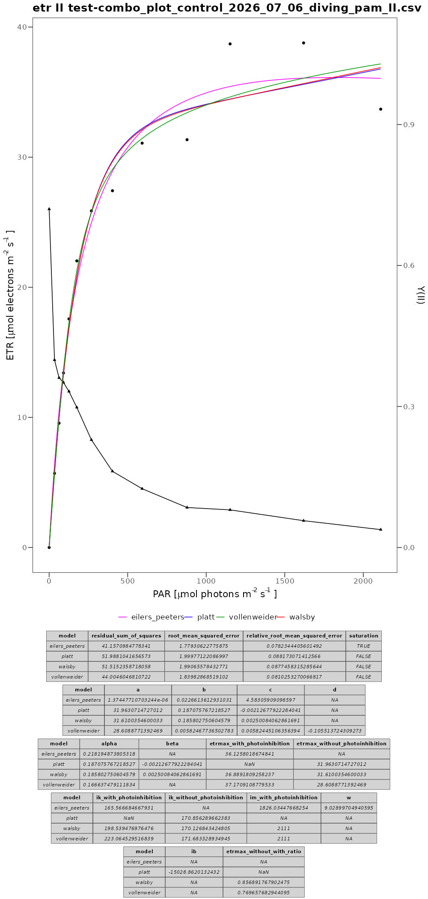

# Modify model results

Those function standardize the naming of the model results depending on the model chosen. 

## vollenweider_modified()

### Parameters

- **model_result**: A list containing the results of the model, including parameters such as `pmax`, `alpha`, and `ik`.

### Return

Returns a modified model result as a list with the following elements:

- **etr_type**: ETR Type based on the model result.
- **etr_regression_data**: Regression data with ETR predictions based on the fitted model.
- **residual_sum_of_squares**: Difference between observed and predicted ETR values, expressed as the sum of squared residuals.
- **root_mean_squared_error**: Difference between observed and predicted ETR values, expressed as the root mean squared error.
- **relative_root_mean_squared_error**: Difference between observed and predicted ETR values, expressed as the relative root mean squared error, normalized by the mean.
- **a**: obtained paramter `a`, here equal to `etrmax_without_photoinhibition`
- **b**: obtained paramter `b`, transfered as `a`
- **c**: obtained paramter `c`, here transfered as `alpha`
- **d**: obtained paramter `c`, here transfered as `n`
- **alpha**: The initial slope of the light curve, calculated as:

$${alpha} = \frac{{etrmax\\_with\\_photoinhibition}}{{ik\\_with\\_photoinhibition}}$$

- **beta**: Not available, here set to `NA_real_`
- **etrmax_with_photoinhibition**: The maximum electron transport rate with photoinhibition, transfered as `popt`
- **etrmax_without_photoinhibition**: The maximum electron transport rate without photoinhibition, transfered as: `pmax`
- **ik_with_photoinhibition**: PAR where the transition point from light limitation to light saturation is achieved taking photoinhibition into account, transfered as: `iik`
- **ik_without_photoinhibition**: PAR where the transition point from light limitation to light saturation is achieved not taking photoinhibition into account, transfered as: `ik`
- **im_with_photoinhibition**: The PAR at which the maximum electron transport rate is achieved by taking photoinhibition into account. Although $I_m$ was mentioned in the original publication, no general solution was presented. Therefore, we decided to include it only in the modified version. Determined as:

```r
 etr_regression_data <- get_etr_regression_data_from_model_result(model_result)
  im_with_photoinhibition <- etr_regression_data[etr_regression_data[[prediction_name]] == max(etr_regression_data[[prediction_name]]), ][[PAR_name]]
```

- **w**: Not available, here set to `NA_real_`
- **ib**: Not available, here set to `NA_real_`
- **etrmax_without_with_ratio**: Ratio of `etrmax_without_photoinhibition` / `etrmax_with_photoinhibition` and  `ik_without_photoinhibition` / `ik_with_photoinhibition`,  transfered as: `pmax_popt_and_ik_iik_ratio`
- **saturation**: Logical flag indicating whether the predicted light curve reached saturation within the tested PAR range

### Details

This function validates the `model_result` input and processes relevant parameters for the Vollenweider model, creating a structured list using `create_modified_model_result`. This standardized output allows for consistent analysis and comparison across different models.

### Examples

```r
modified_result_vollenweider <- vollenweider_modified(model_result_vollenweider)
```


## platt_modified()

### Parameters

- **model_result**: A list containing the results of the model, including parameters such as `etr_max`, `alpha`, and `beta`.

### Return

Returns a modified model result as a list with the following elements:

- **etr_type**: ETR Type based on the model result.
- **etr_regression_data**: Regression data with ETR predictions based on the fitted model.
- **residual_sum_of_squares**: Difference between observed and predicted ETR values, expressed as the sum of squared residuals.
- **root_mean_squared_error**: Difference between observed and predicted ETR values, expressed as the root mean squared error.
- **relative_root_mean_squared_error**: Difference between observed and predicted ETR values, expressed as the relative root mean squared error, normalized by the mean.
- **a**: obtained paramter `a`, here equal to `etrmax_without_photoinhibition`
- **b**: obtained paramter `b`, here equal to `alpha`
- **c**: obtained paramter `c`, here equal to `beta`
- **d**: not available, here set to `NA_real_`
- **alpha**: The initial slope of the light curve, transfered unchanged as `alpha`
- **beta**: The photoinhibition of the light curve, transfered unchanged as `beta`
- **etrmax_with_photoinhibition**: The maximum electron transport rate with photoinhibition, transfered as `pm`
- **etrmax_without_photoinhibition**: The maximum electron transport rate without photoinhibition, transfered as: `ps`
- **ik_with_photoinhibition**: PAR where the transition point from light limitation to light saturation is achieved taking photoinhibition into account, transfered as: `ik`
- **ik_without_photoinhibition**: PAR where the transition point from light limitation to light saturation is achieved not taking photoinhibition into account, transfered as: `is`
- **im_with_photoinhibition**: The PAR at which the maximum electron transport rate is achieved by taking photoinhibition into account, transfered as: `im`
- **w**: Not available, here set to `NA_real_`
- **ib**: Transfered unchange as: `ib`
- **etrmax_without_with_ratio**: Ratio of `etrmax_without_photoinhibition` / `etrmax_with_photoinhibition` and `ik_without_photoinhibition` / `ik_with_photoinhibition`. Calculated as:

$${{etrmax\\_without\\_with\\_ratio}} = \frac{{etrmax\\_without\\_photoinhibition}}{{etrmax\\_with\\_photoinhibition}}$$

- **saturation**: Logical flag indicating whether the predicted light curve reached saturation within the tested PAR range

### Details

This function validates the `model_result` input and processes relevant parameters for the Platt model, creating a structured list using `create_modified_model_result`. This standardized output allows for consistent analysis and comparison across different models.

### Examples

```r
modified_result_platt <- platt_modified(model_result_platt)
```


## eilers_peeters_modified()

This function adds parameters that were not originally included in the Eilers and Peeters (1988) model, but were introduced by other models and renames the parameters to a standardised one for all models. See the table below.

### Parameters

- **model_result**: A list containing the results of the model, including parameters such as `a`, `b`, `c`, `s`, `pm`, `ik`, `im`, and `w`.

### Return

Returns a modified model result as a list with the following elements:

- **etr_type**: ETR Type based on the model result.
- **etr_regression_data**: Regression data with ETR predictions based on the fitted model.
- **residual_sum_of_squares**: Difference between observed and predicted ETR values, expressed as the sum of squared residuals.
- **root_mean_squared_error**: Difference between observed and predicted ETR values, expressed as the root mean squared error.
- **relative_root_mean_squared_error**: Difference between observed and predicted ETR values, expressed as the relative root mean squared error, normalized by the mean.
- **a**: The obtained parameter $$a$$
- **b**: The obtained parameter $$b$$
- **c**: The obtained parameter $$c$$
- **d**: Not available, here set to `NA_real_`
- **alpha**: The initial slope of the light curve, transfered unchanged as `s`
- **beta**: Not available, here set to `NA_real_`
- **etrmax_with_photoinhibition**: The maximum electron transport rate with photoinhibition, transfered as `pm`
- **etrmax_without_photoinhibition**: Not available, here set to `NA_real_`
- **ik_with_photoinhibition**: PAR where the transition point from light limitation to light saturation is achieved taking photoinhibition into account, transfered as `ik`
- **ik_without_photoinhibition**: Not available, here set to `NA_real_`
- **im_with_photoinhibition**: The PAR at which the maximum electron transport rate is achieved by taking photoinhibition into account, transfered as`im`
- **w**: The sharpness of the peak, transfered as `w`
- **ib**: Not available, here set to `NA_real_`
- **etrmax_without_with_ratio**: Not available, here set to `NA_real_`
- **saturation**: Logical flag indicating whether the predicted light curve reached saturation within the tested PAR range

### Details

This function validates the `model_result` input, extracts relevant parameters for the modified Eilers-Peeters model, and creates a structured list using `create_modified_model_result`. The list serves as a standardized output format for further analysis.

### Examples

```r
# Example usage for eilers_peeters_modified
modified_result <- eilers_peeters_modified(model_result_eilers_peeters)
```

## walsby_modified()

### Parameters

- **model_result**: A list containing the results of the model, including parameters such as `etr_max`, `alpha`, and `beta`.

### Return

Returns a modified model result as a list with the following elements:

- **etr_type**: ETR Type based on the model result.
- **etr_regression_data**: Regression data with ETR predictions based on the fitted model.
- **residual_sum_of_squares**: Difference between observed and predicted ETR values, expressed as the sum of squared residuals.
- **root_mean_squared_error**: Difference between observed and predicted ETR values, expressed as the root mean squared error.
- **relative_root_mean_squared_error**: Difference between observed and predicted ETR values, expressed as the relative root mean squared error, normalized by the mean.
- **a**: obtained paramter `a`, here equal to `etrmax_without_photoinhibition`
- **b**: obtained paramter `b`, here equal to `alpha`
- **c**: obtained paramter `c`, here equal to `beta`
- **d**: not available, here set to `NA_real_`
- **alpha**: The initial slope of the light curve, transfered unchanged as `alpha`
- **beta**: The photoinhibition of the light curve, transfered unchanged as `beta`
- **etrmax_with_photoinhibition**: The maximum electron transport rate with photoinhibition, determined as:

```r
  etr_regression_data <- get_etr_regression_data_from_model_result(model_result)
  etr_max_row <- etr_regression_data[etr_regression_data[[prediction_name]] == max(etr_regression_data[[prediction_name]]), ]
  etrmax_with_photoinhibition <- etr_max_row[[prediction_name]]
```

- **etrmax_without_photoinhibition**: The maximum electron transport rate without photoinhibition, transfered as: `etr_max`
- **ik_with_photoinhibition**: PAR where the transition point from light limitation to light saturation is achieved taking photoinhibition into account, calculated as:

$$ik\\_with\\_photoinhibition = \frac{etrmax\\_with\\_photoinhibition}{alpha}$$

- **ik_without_photoinhibition**: PAR where the transition point from light limitation to light saturation is achieved not taking photoinhibition into account, calculated as:

$$ik\\_without\\_photoinhibition = \frac{etrmax\\_without\\_photoinhibition}{alpha}$$

- **im_with_photoinhibition**: The PAR at which the maximum electron transport rate is achieved by taking photoinhibition into account, calculated as:

```r
  etr_regression_data <- get_etr_regression_data_from_model_result(model_result)
  etr_max_row <- etr_regression_data[etr_regression_data[[prediction_name]] == max(etr_regression_data[[prediction_name]]), ]
  im_with_photoinhibition <- etr_max_row[[PAR_name]]
```

- **w**: Not available, here set to `NA_real_`
- **ib**: Not available, here set to `NA_real_`
- **etrmax_without_with_ratio**: Ratio of `etrmax_without_photoinhibition` / `etrmax_with_photoinhibition` and `ik_without_photoinhibition` / `ik_with_photoinhibition`. Calculated as:

$${{etrmax\\_without\\_with\\_ratio}} = \frac{{etrmax\\_without\\_photoinhibition}}{{etrmax\\_with\\_photoinhibition}}$$

- **saturation**: Logical flag indicating whether the predicted light curve reached saturation within the tested PAR range

### Details

This function validates the `model_result` input and processes relevant parameters for the Walsby model, creating a structured list using `create_modified_model_result`. This standardized output allows for consistent analysis and comparison across different photosynthesis models.

### Examples

```r
modified_result <- walsby_modified(model_result_walsby)
```


## Naming overview

### Publication-accurate naming and the respective modified naming

modified        |Eilers and Peeters |Platt    |Walsby          |Vollenweider    |
|-|-|-|-|-|
|residual_sum_of_squares        |residual_sum_of_squares    |residual_sum_of_squares    |residual_sum_of_squares          |residual_sum_of_squares      |
|root_mean_squared_error       |root_mean_squared_error    |root_mean_squared_error    |root_mean_squared_error          |root_mean_squared_error     |
|relative_root_mean_squared_error       |relative_root_mean_squared_error    |relative_root_mean_squared_error    |relative_root_mean_squared_error         |relative_root_mean_squared_error    |
|a         |a     |ps     |etr_max         |pmax      |
|b         |b     |alpha    |alpha          |a       |
|c         |c     |beta    |beta          |alpha      |
|d         |NA     |NA     |NA           |n       |
|alpha        |s     |alpha    |alpha          |NA       |
|beta        |NA     |beta    |beta          |NA       |
|etrmax_with_photoinhibition  |pm     |pm     |NA           |popt      |
|etrmax_without_photoinhibition  |NA     |ps     |etr_max         |pmax      |
|ik_with_photoinhibition   |ik     |ik     |NA           |iik      |
|ik_without_photoinhibition   |NA     |is     |NA           |ik       |
|im_with_photoinhibition   |im     |im     |NA           |NA       |
|w         |w     |NA     |NA           |NA       |
|ib         |NA     |ib     |NA           |NA       |
|etrmax_without_with_ratio   |NA     |NA     |NA           |pmax_popt_and_ik_iik_ratio |


### Publication-accurate naming and the respective modified naming with additional calculations not included in the original publication

|modified      |Eilers and Peeters |Platt    |Walsby          |Vollenweider    |
|-|-|-|-|-|
|residual_sum_of_squares        |residual_sum_of_squares    |residual_sum_of_squares    |residual_sum_of_squares          |residual_sum_of_squares      |
|root_mean_squared_error       |root_mean_squared_error    |root_mean_squared_error    |root_mean_squared_error          |root_mean_squared_error     |
|relative_root_mean_squared_error       |relative_root_mean_squared_error    |relative_root_mean_squared_error    |relative_root_mean_squared_error         |relative_root_mean_squared_error    |
| saturation | saturation | saturation | saturation | saturation |
|a         |a     |ps     |etr_max         |pmax      |
|b         |b     |alpha    |alpha          |a       |
|c         |c     |beta    |beta          |alpha      |
|d         |NA     |NA     |NA           |n       |
|alpha        |s     |alpha    |alpha          |real_alpha     |
|beta        |NA     |beta    |beta          |NA       |
|etrmax_with_photoinhibition  |pm     |pm     |etrmax_with_photoinhibition    |popt      |
|etrmax_without_photoinhibition  |NA     |ps     |etr_max         |pmax      |
|ik_with_photoinhibition   |ik     |ik     |ik_with_photoinhibition     |iik      |
|ik_without_photoinhibition   |NA     |is     |ik_without_photoinhibition     |ik       |
|im_with_photoinhibition   |im     |im     |im_with_photoinhibition     |im_with_photoinhibition |
|w         |w     |NA     |NA           |NA       |
|ib         |NA     |ib     |NA           |NA       |
|etrmax_without_with_ratio   |NA     |etrmax_without_with_ratio  |etrmax_without_with_ratio |pmax_popt_and_ik_iik_ratio |

## Note
### non-saturating curves (saturation value)
The `saturation` value reports whether the fitted light curve reaches its maximum within the measured PAR range. It is `FALSE` when the prediction is still rising at the largest measured PAR value.

When saturation = `FALSE`, treat the derived parameters with caution. Several of them become biologically meaningless. Typical symptoms include:

- `im_with_photoinhibition` and `etrmax_with_photoinhibition` collapse onto the last PAR value. For Walsby and Vollenweider it is taken from the PAR at `max(prediction)`; on a still-rising curve that maximum is simply the last measured point (e.g. 2111 in the example), not a true curve peak.
- `etrmax_without_photoinhibition` values can be lower than`etrmax_with_photoinhibition` values.
- Photoinhibition parameters may be nonsensical. Without a descending branch there is no photoinhibition information in the data, so `beta`, `ib` and `etrmax_without_with_ratio` are extrapolations and can take extreme, unstable or negative values (e.g. the large negative `ib` for platt in the example).

<p align="center">
  
</p>


